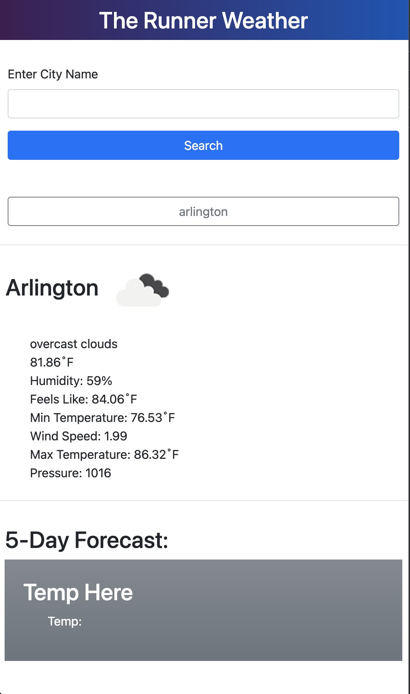

## The runner weather app
This app let the a runner bring up any city weather for the day and a forecast for the next consecutive days.

## How to use it
you are to submit your city location and hit the submit button.

The advantages, you can reuse/revisit the page where you originally searched the city location to extract the weather for and will be able to look at the latest weather for that particular city.

## application libraries used
* Jquery
* bootstrap
* weather api

# The final look

